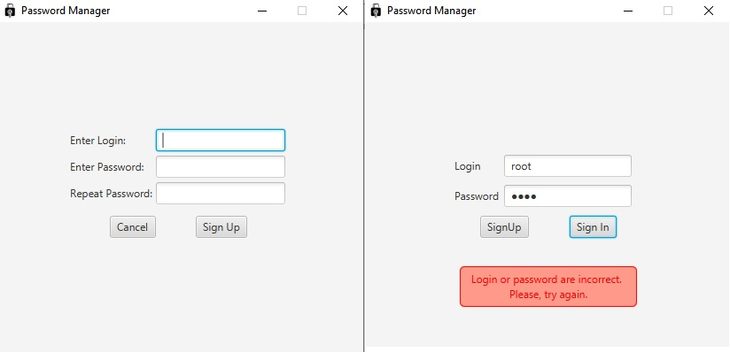

**Password Manager** 

**Good**

- Password manager built with JavaFX and SQLite.

- Passwords are encrypted using AES cipher.

**Bad**

- The project uses a horrendous DAO's with pure JDBC, so there is a lot of boilerplate code.

- Bad coupling between classes. 

- No service layer or error handlers. Everything happens on controller layer.

Main features:
- Create new account
- Sign in with existing account
- Export to/Import from CSV file
- Delete existing account

Images:

- create and save new e-mail/password entry
- change existing entries
- delete entries
- search entries by any field

Images:
 

